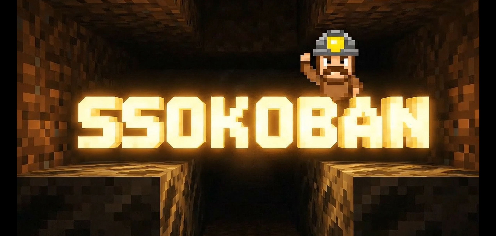

  

# 🧠 SSOKOBAN — n8n & Low-code Automation Tutorials

**SSOKOBAN**은 n8n, OpenAI, Google API, Low-code 플랫폼을 활용한 자동화 워크플로우를  
쉽고 실용적으로 배울 수 있는 튜토리얼을 제공합니다.

> 📺 YouTube: [SSOKOBAN 채널 바로가기](https://www.youtube.com/@SSOKOBAN)  
> 🧭 목표: **“개발자도, 비개발자도, 실제로 돌아가는 자동화를 만든다”**

---
