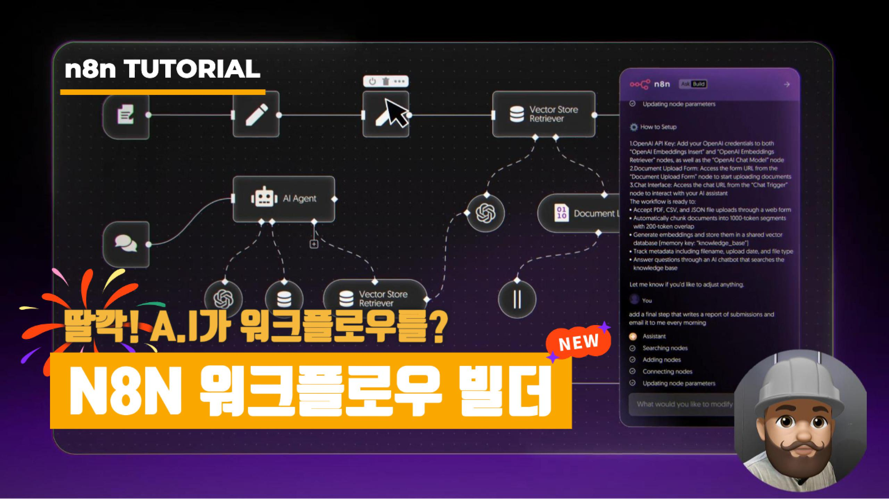

<p align="center">
  <a href="https://youtu.be/B0Wv9YL82WM">
    
  </a>
</p>

# 🧠 SSOKOBAN — n8n & Low-Code Automation  
**콘텐츠 #1: Daily Calendar Analytics & Report Workflow**

[](https://youtu.be/B0Wv9YL82WM)
[](https://n8n.io)
[](https://platform.openai.com/api-keys)

> 매일 18:00에 Google Calendar의 “오늘 일정”을 수집 → 정규화 → GPT로 분석하여 **HTML 보고서**를 만들고 → **Gmail**로 자동 발송하는 워크플로우입니다.  
> *Perplexity 가이드 예시처럼 구조화·재현성·출처 통제 원칙을 지키는 설계입니다.*

---

## 📚 목차
- [개요](#개요)
- [워크플로우 구조](#워크플로우-구조)
- [사전 준비](#사전-준비)
- [Node별 구성](#node별-구성)
  - [Node 1: Daily Trigger](#node-1-daily-trigger)
  - [Node 2: Set Vars](#node-2-set-vars)
  - [Node 3: Google Calendar — List Events](#node-3-google-calendar--list-events)
  - [Node 4: Normalize Events (Function)](#node-4-normalize-events-function)
  - [Node 5: Analyze Calendar & Generate Report (OpenAI)](#node-5-analyze-calendar--generate-report-openai)
  - [Node 6: Send Report via Gmail (Final)](#node-6-send-report-via-gmail-final)
- [완성 HTML 리포트 섹션 구성](#완성-html-리포트-섹션-구성)
- [자주 묻는 질문](#자주-묻는-질문)
- [Assets 업로드 & 배너 적용](#assets-업로드--배너-적용)
- [라이선스](#라이선스)

---

## 개요
일정이 많아질수록 “오늘을 객관적으로 돌아보고 개선 포인트를 찾기”가 어렵습니다.  
본 워크플로우는 **데이터 수집 → 정규화 → 분석 → 배포**를 자동화하여 다음을 제공합니다.

- 🧮 **정량 메트릭**: 총 이벤트 수/시간, 회의·집중 비율, 컨텍스트 스위치, 백투백 등  
- 🔍 **문제 탐지**: 장시간 미팅, 과다 참석자, 안건 없음, 근무시간 외 이벤트 등  
- ✅ **성과(Wins)**: 배포/출시/병합/딜리버리 등 긍정 이벤트  
- 📌 **내일 계획**: 오늘 패턴 기반 제안(집중 블록·버퍼·Agenda-first 등)  
- 📧 **자동 발송**: 매일 18:00, HTML 보고서를 지정 메일로 전달

---

## 워크플로우 구조
[1] Daily Trigger
↓
[2] Set Vars
↓
[3] Google Calendar — List Events
↓
[4] Normalize Events (Function)
↓
[5] Analyze Calendar & Generate Report (OpenAI)
↓
[6] Send Report via Gmail ✅ (Final)

---

## 사전 준비
- n8n (Self-hosted 또는 Cloud)
- Google OAuth2 자격(📆 Calendar, ✉️ Gmail)
- OpenAI API Key (권장: **gpt-4o**)
- 환경값: `RECIPIENT_EMAIL`, `TIMEZONE` (예: `Asia/Seoul`)

---

## Node별 구성

### Node 1: Daily Trigger
매일 **18:00**에 실행됩니다.

**간단 지시문 (n8n AI Builder 복붙용)**
```
Add a Schedule Trigger node that runs every day at 18:00 (6 PM). Configure it to execute daily at a specific time.
```

**필수 설정**
- Interval: `Days`
- Days: `1`
- Hour: `18`
- Minute: `00`

---

### Node 2: Set Vars
보고서 수신자/타임존을 변수로 노출합니다.

**간단 지시문**
```
Add a Set node named "Set Vars" that exposes two variables: RECIPIENT_EMAIL (string) and TIMEZONE (IANA tz like Asia/Seoul).
```

**값 예시**
- `RECIPIENT_EMAIL`: your@email.com
- `TIMEZONE`: `Asia/Seoul`

---

### Node 3: Google Calendar — List Events
**오늘 00:00–23:59**(TIMEZONE 기준)의 이벤트를 모두 가져옵니다.

**간단 지시문**
```
Add a Google Calendar "Get Many" node to fetch all events for today using the TIMEZONE variable for time boundaries. Return all pages.
```

**핵심 파라미터**
- Resource: `Event` / Operation: `Get Many` / Return All: `true`  
- Time Min:
```js
{{ $now.setTimezone($json.TIMEZONE || $vars.TIMEZONE || $env.TIMEZONE).startOf('day').toISO() }}
```

---

### Node 4: Normalize Events (Function)
원본 이벤트를 분석 친화 JSON으로 정제합니다.

**간단 지시문**
```
Add a Function node "Normalize Events" that outputs one item with { events, TIMEZONE } where events is an array of normalized objects.
```

```js
const TZ = $json.TIMEZONE || $vars.TIMEZONE || $env.TIMEZONE || 'UTC';
const { DateTime } = require('luxon');

const normalized = ($input.all().map(i=>i.json)).flat().map(ev=>{
  const sRaw = ev.start?.dateTime || ev.start?.date;
  const eRaw = ev.end?.dateTime || ev.end?.date;
  const allDay = !!ev.start?.date && !ev.start?.dateTime;
  const s = DateTime.fromISO(sRaw, { zone: TZ });
  const e = DateTime.fromISO(eRaw, { zone: TZ });
  const dur = Math.max(0, e.diff(s, 'minutes').minutes);

  return {
    summary: ev.summary || '(no title)',
    description: ev.description || '',
    start: s.toISO(),
    end: e.toISO(),
    duration_minutes: Math.round(dur),
    attendee_count: Array.isArray(ev.attendees) ? ev.attendees.length : 0,
    html_link: ev.htmlLink || '',
    location: ev.location || '',
    status: ev.status || '',
    organizer: ev.organizer?.displayName || ev.organizer?.email || '',
    all_day: allDay
  };
});

return [{ json: { events: normalized, TIMEZONE: TZ } }];
```
---
### Node 5: Analyze Calendar & Generate Report (OpenAI)
gpt-4o로 분석하여 **HTML + 메트릭(JSON)**을 생성합니다.

**모델 권장값**
- Model: gpt-4.1 
- Temperature: 0.1
- Max Tokens: 4000+
- JSON mode: 가능 시 활성화
- User Prompt (요약 번역본 포함)

```
You are a daily productivity report generator. Your task is to analyze calendar events and generate a comprehensive daily report.

IMPORTANT RULES:
1) Use ONLY the provided events data — NO fabrication.
2) Access events: {{ $('Normalize Events').item.json.events }}
3) Access timezone: {{ $('Set Vars').item.json.TIMEZONE }}

Return a single JSON object with:
- html (full HTML with inline CSS, sections: header/date/stats, chronological events, time analysis, insights, problems, wins, tomorrow_plan)
- metrics { total_events, total_hours, meeting_count, all_day_events, busiest_hour, free_time_hours }
- problems[] (e.g., back-to-back, overbooked, missing descriptions)
- wins[] (e.g., shipped, launched, focused blocks)
- tomorrow_plan[] (actionable suggestions)

If there are no events, reflect it honestly in both HTML and metrics.
```
---
### Node 6: Send Report via Gmail (Final)
Node 5의 html을 메일 본문으로 발송합니다. 최종 노드입니다.

**간단 지시문**
```
Add a Gmail node to send an email with the AI-generated HTML report to RECIPIENT_EMAIL. Subject includes today's date (YYYY-MM-DD). Body uses the `html` field from the previous node.
```

**중요 설정**
- Resource: Message / Operation: Send
- To:
```js
{{ $env.RECIPIENT_EMAIL || $json.RECIPIENT_EMAIL || $vars.RECIPIENT_EMAIL }}
```
- Subject:
```js
Daily Calendar Analytics & Productivity Report – {{ $now.format('YYYY-MM-DD') }}
```
- Body:
```js
{{ $json.html }}
```
- HTML: true


